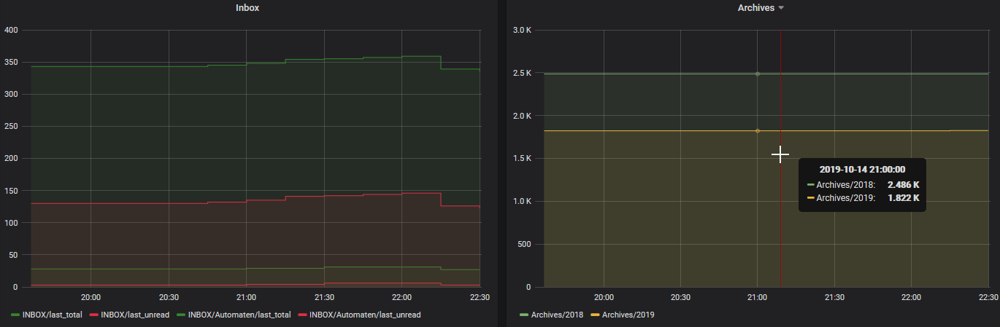

# Mailstats Influx

Posts the number of mails in an IMAP dir to influxdb. This can be turned into
nice charts in any number of ways. I'm using Grafana:

## Setup

copy `config.js.example` to `config.js` (or whatever name suits you), and fill
in all the details.

## Usage

    node index.js ./config.js
